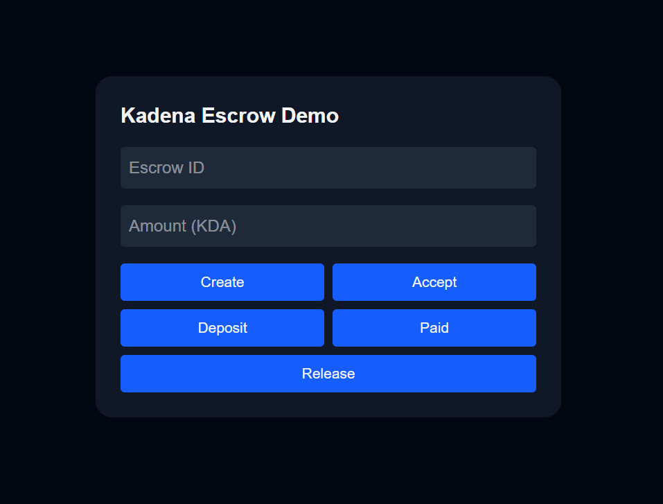

This is a [Next.js](https://nextjs.org) project bootstrapped with [`create-next-app`](https://nextjs.org/docs/app/api-reference/cli/create-next-app).

## How To Start

First, run the development server:

```bash
npm run dev
# or
yarn dev
# or
pnpm dev
# or
bun dev
```

Open [http://localhost:3000](http://localhost:3000) with your browser to see the result.

# Kadena Non-Custodial Escrow Demo

## What This Project Is

This project is a **simple demonstration of a non-custodial escrow system built on the Kadena blockchain**.

It shows how **two people can safely exchange value** using a smart contract, without trusting a third party, server, or company to hold the money.

The **blockchain itself holds the funds and enforces the rules**.

---

## Why This Exists

Traditional escrow systems rely on:
- A company or server
- A database
- A trusted middleman

This demo removes all of that.

Instead:
- The **smart contract controls the money**
- The **blockchain stores the data**
- The **rules are enforced by code**

No one — not even the developer — can take the funds outside the allowed flow.

---

## How It Works (Simple Flow)

1. **Seller creates an escrow**
   - Defines the amount
   - Chooses an arbiter (for disputes)
   - No money is locked yet

2. **Buyer accepts the escrow**
   - Buyer is now linked to this escrow
   - No one else can take it

3. **Seller deposits funds**
   - The money is sent into the smart contract
   - The contract now owns the funds

4. **Buyer marks payment complete**
   - Represents an off-chain payment (cash, bank, etc.)
   - No money moves on-chain at this step

5. **Funds are released or refunded**
   - Seller (or arbiter) releases funds to buyer, or
   - Arbiter refunds seller in case of dispute

Every step must happen in order.  
Invalid actions are automatically rejected by the blockchain.

    CREATED → ACCEPTED → FUNDED → PAID
        |
        ├─ RELEASED → COMPLETED
        |
        └─ REFUNDED → REFUNDED

---

## What Makes This Safe

- **Non-custodial**: No wallet or server holds the funds
- **On-chain rules**: All logic runs on the blockchain
- **State-based**: Each action is allowed only in the correct order
- **No backend**: Nothing off-chain can manipulate the escrow

If the UI disappears, the escrow still works.

---

## What the Frontend Does

The frontend is built with **Next.js and Tailwind CSS**.

It:
- Lets users enter data
- Sends transactions to the blockchain
- Shows basic interaction flow

It does **not**:
- Store escrow data
- Control funds
- Enforce rules

The smart contract does all of that.

---

## What This Demo Is (and Is Not)

**This is:**
- A clear, working proof-of-concept
- A learning and demonstration tool
- A foundation for more advanced systems

**This is not:**
- A full marketplace
- A production-ready product
- A complete dispute resolution system

Those can be added later without changing the core design.

---

## Why It Matters

This demo shows how **trust can be replaced by code**.

It proves that:
- Escrow can work without middlemen
- Blockchains can act as databases
- Smart contracts can safely manage money

This same design can later be extended to **DeFi**, **marketplaces**, or **cross-chain systems**.

---

## Summary (One Sentence)

> This project shows how a smart contract on Kadena can safely hold funds and enforce escrow rules without any backend, database, or trusted third party.

